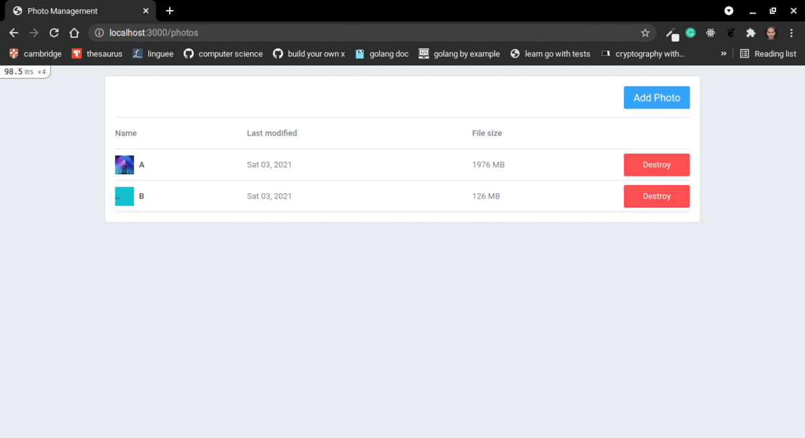

## :rocket: Project

:camera: POC to learn how to use Shrine

### Preview

<p align="center">

</p>

## Requirements

### Entities

- Photo
  * id
  * name
  * image
  * opened_at
  * created_at
  * updated_at

### Functionalities

- [x] Create a photo

- [x] List all photos

- [x] Show a photo

- [x] Edit a photo

- [x] Destroy a photo

### Restrictions

- [x] Image upload should be local

## :computer: Techs

- Ruby
- Ruby on Rails
- RSpec
- Shrine

## :thinking: How to use

```sh
git clone git@github.com:flaviogf/photo_management.git

cd photo_management

docker-compose up -d --build

docker-compose exec web bin/rails webpacker:yarn_install

docker-compose exec web bin/rails db:setup

docker-compose exec web bin/rails db:prepare

# It's running at http://localhost:3000
```

## :memo: License

This project contains the MIT license. See the file [LICENSE](LICENSE).